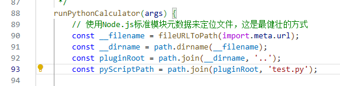

# 原神 & 星铁抽卡期望计算器

计算《原神》和《崩坏：星穹铁道》抽卡期望与概率分布。

PS：之前有大佬写过一个，但是已经两年没更新，不适配现在的命定值-1和捕获明光了，所以重新整了一个。

该插件已集成至[Xtower-Plugin](https://gitee.com/sczr/Xtower-Plugin),因此该仓库可能不会及时更新。

## ⚠️ 前置依赖

在开始之前，请确保您的服务器已经安装了 **Python 3** 环境和 **Numpy** 库，并将js和py文件一起放在example文件夹下，否则该功能将无法正常工作。

您可以通过以下命令进行安装：
```bash
# 安装 Python 3 (根据您的系统包管理器)
# Debian/Ubuntu
sudo apt update
sudo apt install python3 python3-pip

# 安装 Numpy 库
pip3 install numpy
```

如果想要更改py文件的名字，请更改这里。


## 📖 帮助文档

### 指令列表
-   `#期望计算 [参数...]`  (快速获取平均抽数)
-   `#期望分布 [参数...]`  (获取详细的概率分布，如欧皇/非酋线)
-   `#期望计算帮助`        (查看此帮助文档)

### 参数说明

所有参数的顺序可以随意组合。

-   **游戏**: `原神`, `星铁`
-   **卡池**: `角色`, `武器`, `光锥`
-   **数量**: `3个`, `6命`, `2魂` (默认为 1)
-   **垫抽**: `20抽`, `50垫` (默认为 0)
-   **保底**: `大保底`, `小保底` (默认为小保底)
-   **预算**: `预算180抽` (**仅分布模式可用**，用于计算在该预算内的成功率)
-   **明光**: `明光2` (仅原神角色池可用)
-   **定轨**: `定轨1`, `命定1` (仅原神武器池可用)
-   **四星状态**: `四星满命` (**仅分布模式下的角色池可用**，用于更精确地计算返还物)

### 使用示例

-   计算获取3个UP角色的平均期望抽数：
    ```
    #期望计算 原神 角色 3个
    ```
-   查看在有预算的情况下，获取1个UP角色的详细概率分布，并考虑UP四星均已满命：
    ```
    #期望分布 星铁 角色 1个 四星满命 预算150抽
    ```